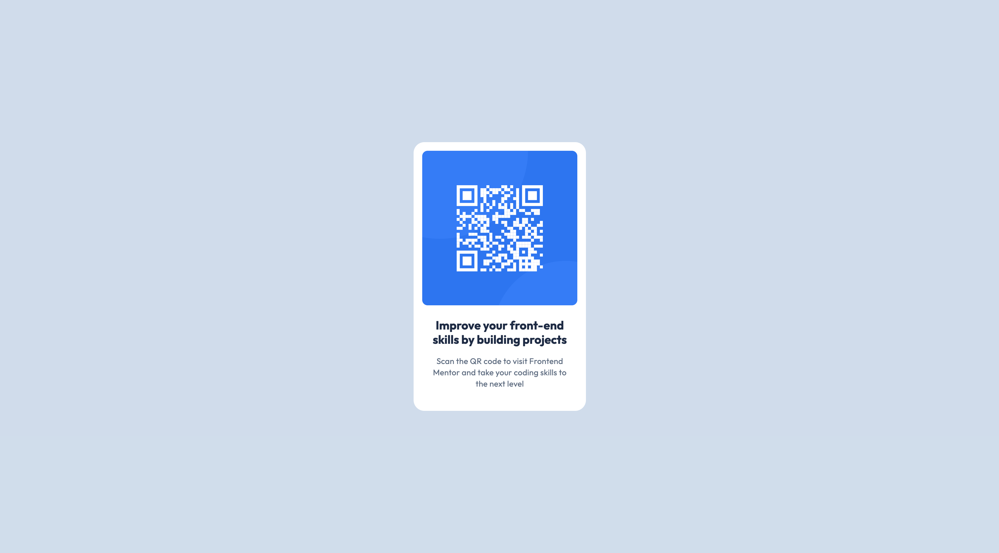

# Frontend Mentor - QR code component solution

This is a solution to the [QR code component challenge on Frontend Mentor](https://www.frontendmentor.io/challenges/qr-code-component-iux_sIO_H).

## Table of contents

- [Overview](#overview)
  - [Screenshot](#screenshot)
  - [Features](#features)
  - [Extra feature](#extra-feature)
  - [Links](#links)
- [My process](#my-process)
  - [Built with](#built-with)
  - [What I learned](#what-i-learned)
  - [AI Collaboration](#ai-collaboration)

## Overview

### Screenshot

#### Screenshot desktop



### Features

1. The challenge is to build out this QR code component and get it looking as close to the design as possible.

### Extra feature

**As a** User,<br>
**I need to** be able to zoom on the QR code<br>
**So that** it will be easier to scan the QR code

### Links

- [Repository URL](https://github.com/MATBMS/qr-code-component)
- [Live Site URL](https://matbms.github.io/qr-code-component/)

## My process

### Built with

- Semantic HTML5 markup
- CSS custom properties
- Flexbox
- CSS Grid
- Mobile-first workflow

### What I learned

#### Internal Fonts

The `@font-face` CSS at-rule specifies a custom font with which to display text; the font can be loaded from either a remote server or a locally-installed font on the user's own computer.

To make weights work correctly with variables, I structure your stylesheet like this:

```css
@font-face {
  font-family: "Outfit";
  src: url("./fonts/Outfit-Regular.ttf") format("truetype");
  font-weight: 400;
}

@font-face {
  font-family: "Outfit";
  src: url("./fonts/Outfit-Bold.ttf") format("truetype");
  font-weight: bold;
}
```

#### Custom Properties

**Custom properties** (sometimes referred to as **CSS variables** or **cascading variables**) are entities defined by CSS authors that represent specific values to be reused throughout a document.

```css
:root {
  /* color */
  --color-slate-900: #1f314f;
  --color-slate-500: #68778d;
  --color-slate-300: #d5e1ef;
  --color-white: #fff;
  /* spacing */
  --spacing-500: 40px;
  --spacing-300: 24px;
  --spacing-200: 16px;
}
```

Once the custom properties are set up on the `:root` element, you can access them anywhere in your project.

```css
body {
  background-color: var(--color-slate-300);
}
```

#### Media Queries

Media queries allow you to apply CSS styles depending on a device's media type (such as print vs. screen) or other features or characteristics such as screen resolution or orientation, aspect ratio, browser viewport width or height, user preferences such as preferring reduced motion, data usage, or transparency.

Many range features can be prefixed with "min-" or "max-" to express "minimum condition" or "maximum condition" constraints. For example, this CSS will apply styles only if your browser's viewport width is equal to or narrower than 1440px:

```css
/* MOBILE (375px and up) */
@media (min-width: 375px) {
}

/* TABLET (768px and up) */
@media (min-width: 768px) {
}

/* DESKTOP (1440px and up) */
@media (min-width: 1440px) {
}
```

#### Update User Snippet

To update your user snippets in Visual Studio Code (VS Code), you need to open the relevant snippet JSON configuration file via the Command Palette and modify its properties.

##### Step-by-Step Guide

1. **Open the command palette**: Press `Cmd + Shift + P`.
1. **Find the snippet settings**: Type `Preferences: Configure User Snippets` and press `Enter`.
1. **Select your snippet file**:
   - To update an existing snippet, chose the specific **language** (e.g., `javascript.json`, `python.json`) or the **global snippet file** you created previously.
   - If you are creating a new one, select "**New Global Snippets file\***..." and name it.
1. **Edit the JSON code**: Modify the fields inside the JSON object.
1. **Save the file**: Press `Cmd + S`. The changes will take effect immediately.

##### Example

```json
{
  "Responsive Media Queries": {
    "prefix": "responsive",
    "body": [
      "/* MOBILE (375px and up) */",
      "@media (min-width: 375px) {$1}",
      "",
      "/* TABLET (768px and up) */",
      "@media (min-width: 768px) {$2}",
      "",
      "/* DESKTOP (1440px and up) */",
      "@media (min-width: 1440px) {$3}"
    ],
    "description": "Insert responsive media queries template with accessible em units"
  }
}
```

##### Key Properties to Update

- **scope**: (Global files only) A comma-separated list of language identifiers restricting where the snippet works.
- **prefix**: The abbreviation or shortcut word typed to trigger IntelliSense.
- **body**: An array of strings representing the lines of code. Use `$1`, `$2` for tab stops, and `$0` for the final cursor position.
- **description**: The helper text displayed in the auto-complete dropdown menu.

#### Box Shadow

The box-shadow CSS property adds shadow effects around an element's frame. You can set multiple effects separated by commas. A box shadow is described by X and Y offsets relative to the element, blur and spread radius, and color.

#### Animate on hover

To zoom into an image smoothly on hover without causing layout shifts, pair `transform: scale()` with CSS `transition`, and place the image inside a container with `overflow: hidden`.

```css
.qr-code-container {
  overflow: hidden; /* Clips the zoomed image within the container bounds */
  border-radius: 10px;
}

.qr-code-image {
  /* Animate the transform property smoothly */
  transition: transform 0.4s cubic-bezier(0.25, 1, 0.5, 1);
}

.qr-code-image:hover {
  transform: scale(1.5);
}
```

### AI Collaboration

No AI was used in this project.
